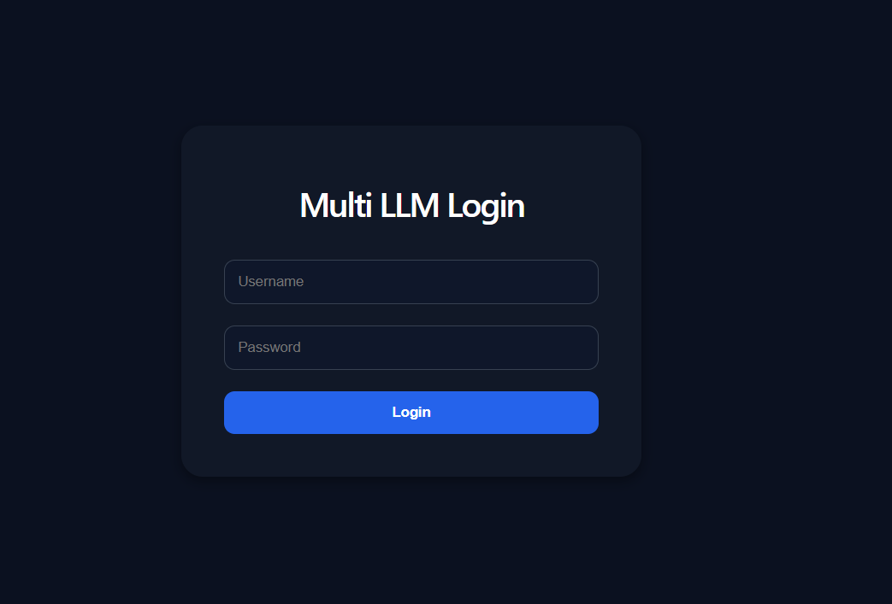
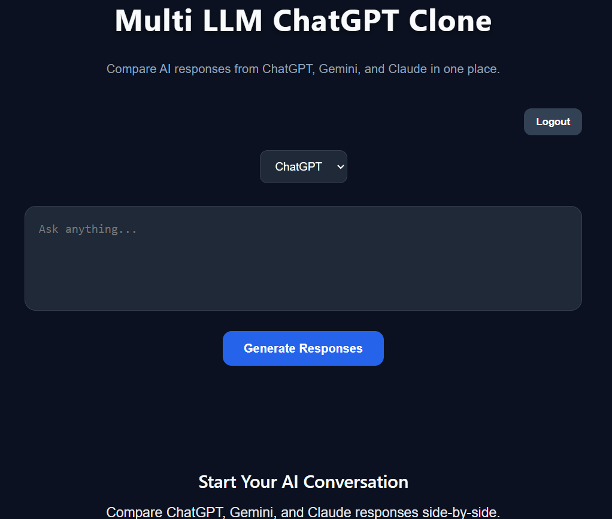
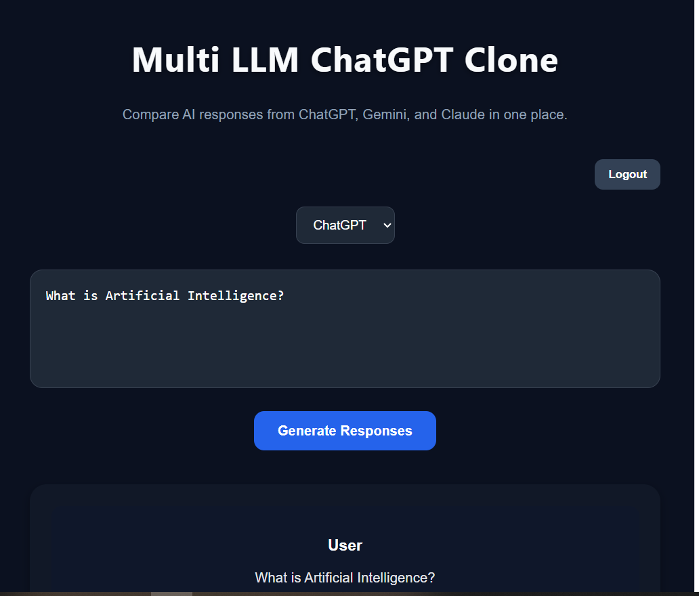
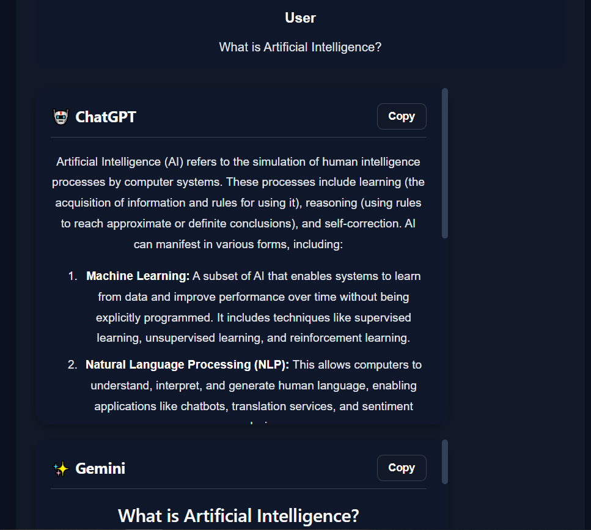
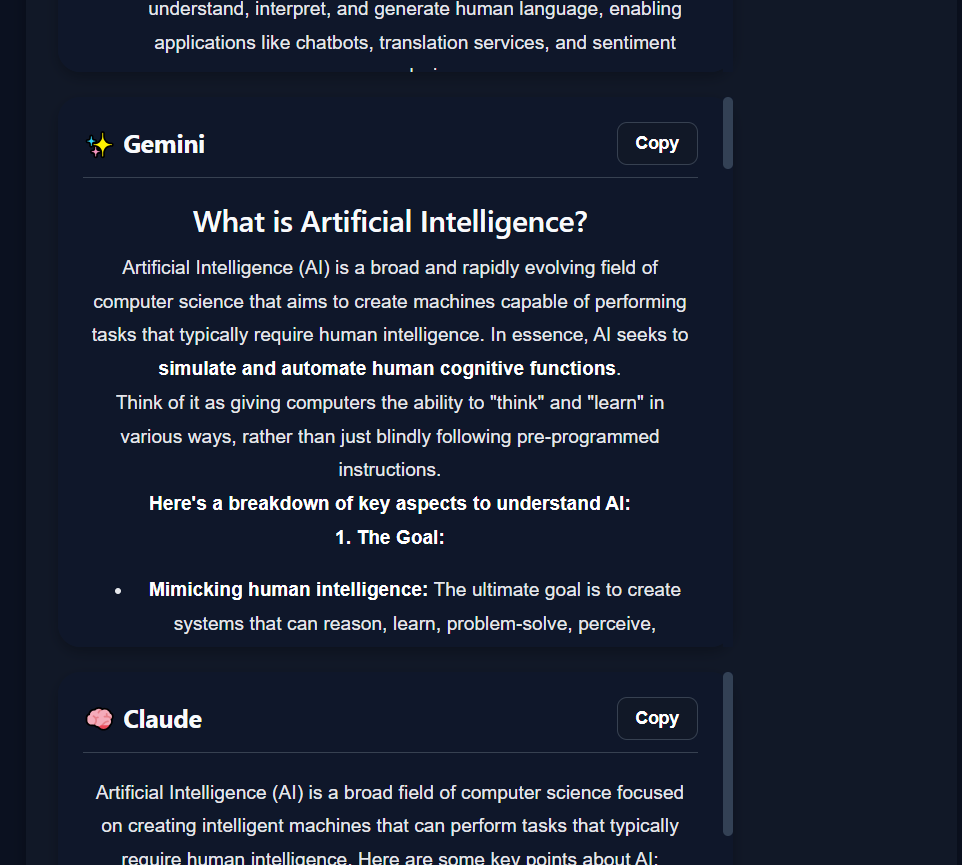
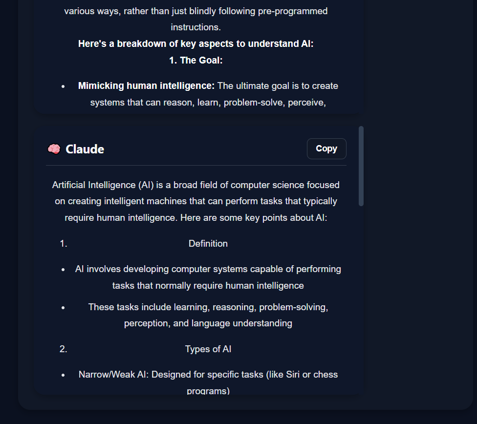
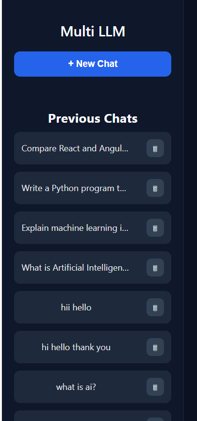
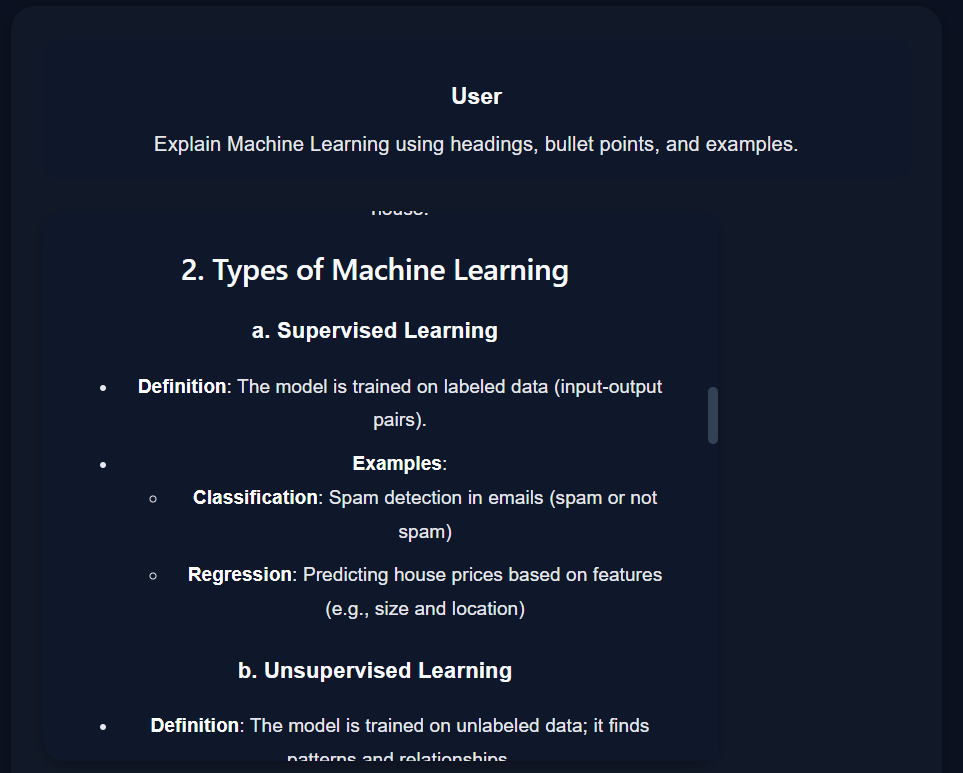

# 🤖 Multi-LLM AI Comparison Platform

A full-stack AI application that compares responses from multiple Large Language Models (LLMs) side-by-side. Users can enter a prompt and instantly compare answers generated by ChatGPT, Gemini, and Claude in a single interface.

The project is built using React, Node.js, Express, PostgreSQL, and OpenRouter API.

---

# 🚀 Features

* Compare ChatGPT, Gemini, and Claude responses side-by-side
* Real AI integration using OpenRouter API
* Prompt and System Prompt support
* Continue conversation with selected model
* Chat history sidebar
* Delete chat functionality
* New Chat functionality
* Login and Logout system
* Markdown rendering for AI responses
* Typing animation effect
* Copy response functionality
* Auto-scroll chat interface
* PostgreSQL database integration
* Responsive dark-themed UI
* Environment variable configuration

---

# 🏗️ Tech Stack

## Frontend

* React.js
* Vite
* Axios
* React Markdown

## Backend

* Node.js
* Express.js

## Database

* PostgreSQL

## AI Integration

* OpenRouter API
* GPT-4o Mini
* Gemini 2.5 Flash
* Claude 3.5 Haiku

---

# 🧠 AI Concepts Implemented

* Prompt Engineering
* System Prompt Design
* Multi-LLM Architecture
* AI Response Comparison
* Chat Session Management
* Frontend-Backend API Communication
* Real-Time AI Response Handling

---

# 📂 Project Structure

```bash
multi-llm-chatgpt-clone
│
├── client
│   ├── src
│   ├── public
│   ├── package.json
│   └── vite.config.js
│
├── server
│   ├── server.js
│   ├── package.json
│   ├── .env
│   └── .env.example
│
├── README.md
└── .gitignore
```

---

# ⚙️ Installation

## 1. Clone Repository

```bash
git clone <your-github-repository-link>
```

---

## 2. Frontend Setup

```bash
cd client
npm install
npm run dev
```

Frontend runs on:

```bash
http://localhost:5173
```

---

## 3. Backend Setup

```bash
cd server
npm install
node server.js
```

Backend runs on:

```bash
http://localhost:5000
```

---

# 🗄️ PostgreSQL Setup

Create a PostgreSQL database:

```sql
CREATE DATABASE multillm;
```

Create the chats table:

```sql
CREATE TABLE chats (
    id SERIAL PRIMARY KEY,
    prompt TEXT,
    chatgpt TEXT,
    gemini TEXT,
    claude TEXT
);
```

---

# 🔐 Environment Variables

Create a `.env` file inside the `server` folder.

```env
PORT=5000

OPENROUTER_API_KEY=your_openrouter_api_key

DB_HOST=localhost
DB_USER=postgres
DB_PASSWORD=your_password
DB_NAME=multillm
DB_PORT=5432
```

---

# 💬 Prompt vs System Prompt

## Prompt

The user message entered into the chat interface.

Example:

```text
What is Artificial Intelligence?
```

---

## System Prompt

An instruction provided to the AI model before processing the user prompt.

Example:

```text
You are a helpful AI assistant.
```

System prompts control:

* AI behavior
* Tone
* Personality
* Response style

---

# 🔄 Application Flow

```text
User
 ↓
React Frontend
 ↓
Express Backend
 ↓
OpenRouter API
 ↓
GPT / Gemini / Claude
 ↓
PostgreSQL Database
 ↓
Frontend Display
```

---

# 📸 Screenshots

## Login Page



## Dashboard



## AI Comparison






## Chat History



## Markdown Rendering



---

# 🔮 Future Improvements

* Cloud Deployment (Vercel + Render)
* Docker Support
* Real Authentication System
* Streaming Responses
* User Profiles and Settings
* Export Chat Conversations

---

# 👨‍💻 Author

Created as part of AI/ML learning and Multi-LLM architecture exploration.

This project demonstrates full-stack development, database integration, API integration, prompt engineering concepts, and modern AI application design.
